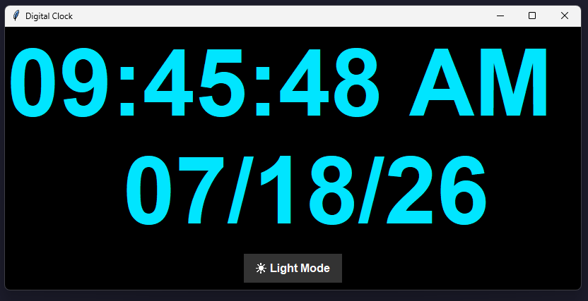
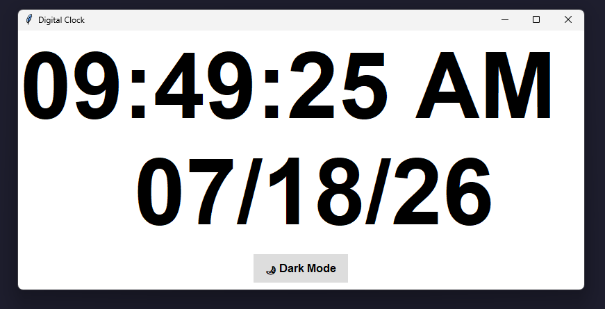

# 🕒 Digital Clock with Light & Dark Mode

A modern **Digital Clock Desktop Application** built using **Python** and **Tkinter**. The application displays the current time and date in real time and allows users to switch between **Light Mode** and **Dark Mode** with a single click.

---

## 📸 Preview

<p align="center">
  
  
</p>

---

## ✨ Features

- ⏰ Real-time digital clock
- 📅 Displays current date
- 🌗 Toggle between Light Mode and Dark Mode
- 🎨 Clean and modern UI
- ⚡ Updates every second automatically
- 🖥️ Lightweight desktop application
- 💻 Beginner-friendly Python project

---

## 🛠️ Built With

- **Python 3**
- **Tkinter** (GUI Framework)
- **time** module

---

## 📂 Project Structure

```
Digital-Clock/
│
├── digital_clock.py
├── README.md
└── assets/
    ├── dark.png
    └── light.png
```

---

## 🚀 Getting Started

### Prerequisites

- Python 3.x installed on your system

Check your Python version:

```bash
python --version
```

---

### Installation

1. Clone the repository

```bash
git clone https://github.com/Eripillivijay/Python-Projects/tree/main/4.Digital-Clock
```

2. Navigate to the project directory

```bash
cd digital-clock
```

3. Run the application

```bash
python main.py
```

---

## 🎯 How It Works

- The application uses the **time.strftime()** function to fetch the current system time and date.
- The **after()** method refreshes the displayed time every second.
- A toggle button changes the application's theme between **Dark Mode** and **Light Mode**.

---

## 📷 Screenshots

<p align="center">
  
</p>

### ☀️ Light Mode

<p align="center">
  
</p>

---

## 🧠 Concepts Used

- Tkinter GUI
- Event-driven Programming
- Functions
- Global Variables
- Theme Switching
- Real-time UI Updates
- Python Time Module

---


## ⭐ Show Your Support

If you found this project helpful, please consider giving it a ⭐ on GitHub.

---

## 👨‍💻 Author

**Vijay**

GitHub: https://github.com/Eripillivijay

---

## 📄 License

This project is licensed under the **MIT License**.

Feel free to use, modify, and distribute it for educational and personal purposes.

---


> **"Simple projects demonstrate strong fundamentals. This project showcases GUI development, event handling, and real-time programming using Python."**